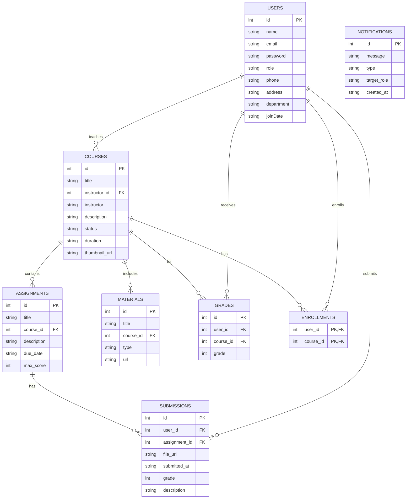
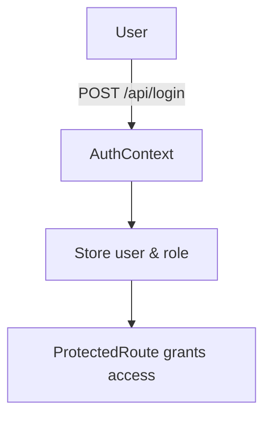
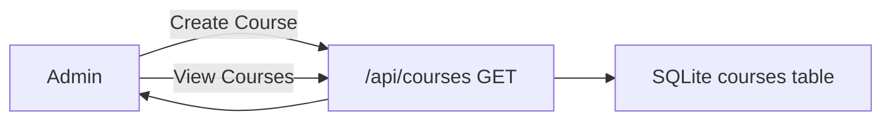
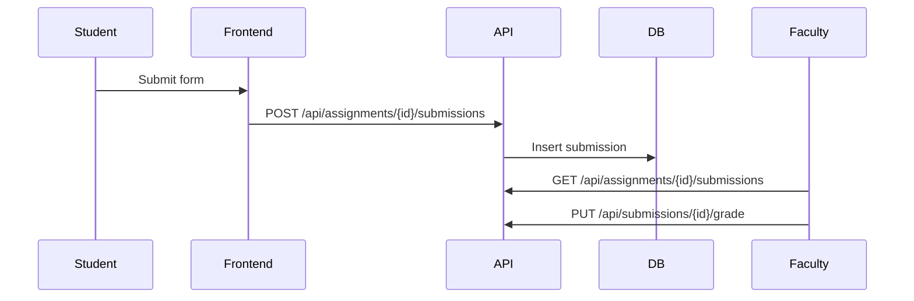
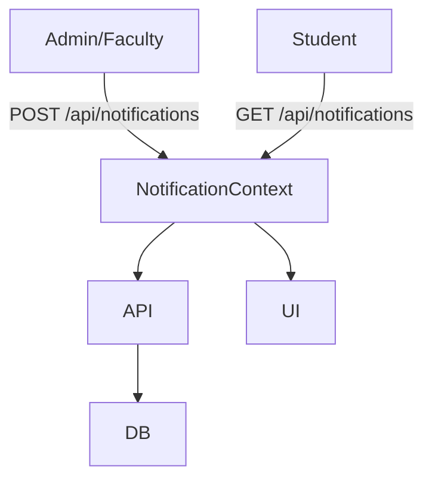
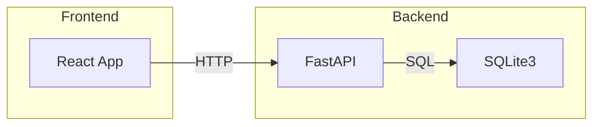
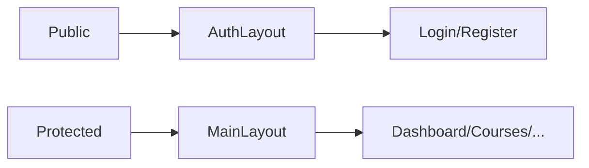
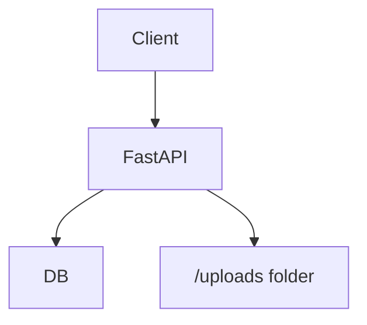

# LearnTrack Project Documentation

---

## Problem Statement

> DBMS SQLite College Project

Learn Track streamlines course access, submission tracking, and academic progress for students and faculty. It supports resource uploading, grading, feedback, and certificate downloads. Personalized dashboards give real-time academic analytics. The system supports semester-based enrollment, auto-notifications, and bulk result uploads.

> User Responsibilities
- Student: Enroll in courses and view syllabus; Submit assignments and check grades; Access study material and feedback
- Faculty: Upload lecture content; Grade submissions and provide remarks; Track student performance
- Admin: Approve new course creation; Manage user permissions; Generate result analysis and performance reports

> Allowed Tools
- Frontend: React, framer-motion, Tailwind CSS, etc.
- Backend: Python (FastAPI) with SQLite3

---

## Table of Contents
- [Overview](#overview)
- [Features](#features)
- [Tech Stack](#tech-stack)
- [Folder Structure](#folder-structure)
- [Getting Started](#getting-started)
  - [Prerequisites](#prerequisites)
  - [Installation](#installation)
  - [Running the Application](#running-the-application)
- [Frontend](#frontend)
  - [Frameworks & Libraries](#frameworks--libraries)
  - [Routing & Layouts](#routing--layouts)
  - [Contexts](#contexts)
  - [Pages & Components](#pages--components)
- [Backend](#backend)
  - [Framework & Setup](#framework--setup)
  - [API Endpoints](#api-endpoints)
- [Database](#database)
  - [Schema](#schema)
  - [ER Diagram](#er-diagram)
  - [Migrations](#migrations)
- [Workflows](#workflows)
  - [Authentication Flow](#authentication-flow)
  - [Course Management Flow](#course-management-flow)
  - [Assignment Submission & Grading Flow](#assignment-submission--grading-flow)
  - [Notification Flow](#notification-flow)
- [Diagrams](#diagrams)
  - [System Overview](#system-overview)
  - [Frontend Routing](#frontend-routing)
  - [Backend API Flow](#backend-api-flow)
- [Environment Variables](#environment-variables)
- [Contributing](#contributing)
- [License](#license)

---

## Overview
LearnTrack streamlines course access, submission tracking, and academic progress for students and faculty. It supports resource uploading, grading, feedback, and certificate downloads. Personalized dashboards provide real-time analytics. The system supports semester-based enrollment, auto-notifications, and bulk result uploads.

## Features
- User authentication & role-based access (student, faculty, admin)
- Course management (CRUD, enrollment)
- Assignment creation, submission, grading
- File uploads for materials and submissions
- Real-time notifications
- Dashboard analytics and reports
- Dark/light theme support

## Tech Stack
- **Frontend:** React, TypeScript, Framer Motion, Tailwind CSS, React Router
- **Backend:** FastAPI (Python), SQLite
- **Database:** SQLite3
- **Authentication:** password hashing (bcrypt)

## Folder Structure
```text
LearnTrack/
├── backend/            # FastAPI server
├── public/             # Static assets
├── src/                # React application
│   ├── components/     # UI & dashboards
│   ├── contexts/       # Auth, Theme, Notifications
│   ├── layouts/        # Auth & Main layouts
│   ├── pages/          # Route-based pages
│   └── App.tsx         # Routes configuration
├── database.db         # SQLite database
├── package.json        # Frontend dependencies
└── Readme.md             # Project documentation
```  

## Getting Started

### Prerequisites
- Node.js >= 18
- pnpm or npm
- Python 3.9+
- pip

### Installation
```bash
# Frontend setup
cd LearnTrack
pnpm install

# Backend setup
cd backend
pip install -r requirements.txt
```

### Running the Application
```bash
# Start backend (FastAPI)
cd backend
uvicorn app:app --host 0.0.0.0 --port 5000 --reload

# Start frontend (Vite)
cd LearnTrack
pnpm dev
```
> Open http://localhost:5173 in your browser.

## Frontend

### Frameworks & Libraries
- React & TypeScript
- React Router v6
- Framer Motion for animations
- Tailwind CSS for styling
- Context API for state (Auth, Theme, Notifications)

### Routing & Layouts
- Public routes under `AuthLayout`
- Protected routes under `MainLayout`
- Role-based guard via `ProtectedRoute` component

### Contexts
- **AuthContext:** Manages user, role, token
- **ThemeContext:** Toggles dark/light mode
- **NotificationContext:** Handles in-app notifications

### Pages & Components
- **LandingPage:** Marketing page
- **Login/Register/ForgotPassword**
- **Dashboard:** Role-specific overview
- **Courses/Assignments/Materials/Grades/Profile**
- **Admin & Faculty panels** under `/pages/admin`, `/pages/faculty`
- Reusable UI in `components/ui` (Button, Card, Input)

## Backend

### Framework & Setup
- FastAPI application in `backend/app.py`
- Middleware: CORS
- File uploads via `StaticFiles`
- SQLite connection helper and migrations

### API Endpoints
```text
POST   /api/register
POST   /api/login
GET    /api/courses
GET    /api/courses/{id}
POST   /api/courses
PUT    /api/courses/{id}
DELETE /api/courses/{id}
GET    /api/enrollments?user_id=
POST   /api/enroll
DELETE /api/enroll
GET    /api/assignments
POST   /api/assignments
GET    /api/assignments/{id}
DELETE /api/assignments/{id}
GET    /api/assignments/{id}/submissions
POST   /api/assignments/{id}/submissions
PUT    /api/submissions/{id}/grade
GET    /api/materials
POST   /api/materials
DELETE /api/materials/{id}
GET    /api/grades?user_id=
GET    /api/notifications?target_role=
POST   /api/notifications
PUT    /api/notifications/{id}
DELETE /api/notifications/{id}
GET    /api/reports/performance
GET    /api/reports/metrics
```
> Run backend and go http://localhost:5000/docs for checking endpoints

## Database

### Schema
- **users:** id, name, email, password, role, phone, address, department, joinDate
- **courses:** id, title, instructor_id, description, status, duration, thumbnail_url
- **enrollments:** user_id, course_id
- **assignments:** id, title, course_id, description, due_date, max_score
- **submissions:** id, user_id, assignment_id, file_url, description, submitted_at, grade
- **materials:** id, title, course_id, type, url
- **grades:** id, user_id, course_id, grade
- **notifications:** id, message, type, target_role, created_at  

### ER Diagram



### Migrations
On startup, `init_db()` adds missing columns and migrates data.

## Workflows

### Authentication Flow


### Course Management Flow


### Assignment Submission & Grading Flow


### Notification Flow


## Diagrams

### System Overview


### Frontend Routing


### Backend API Flow


## Environment Variables
- **VITE_API_URL**: Base URL for backend (default `http://localhost:5000`)

## Contributing
1. Fork the repo
2. Create a new branch
3. Submit a pull request

## License
MIT © [0xarchit](https://github.com/0xarchit)
